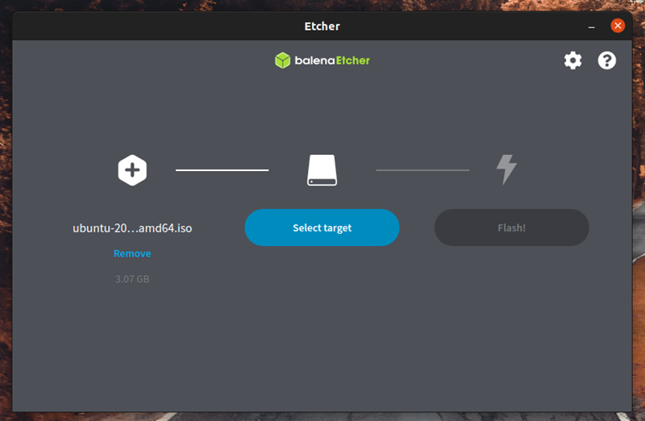
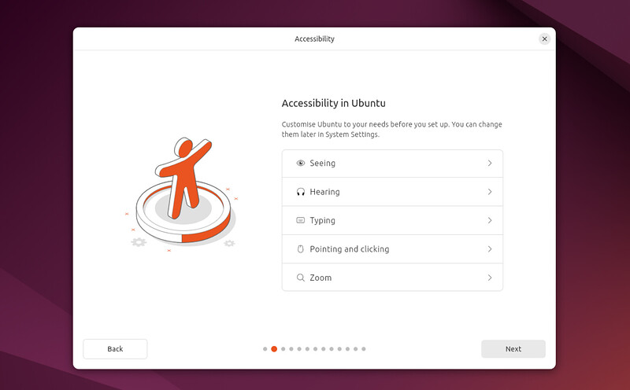
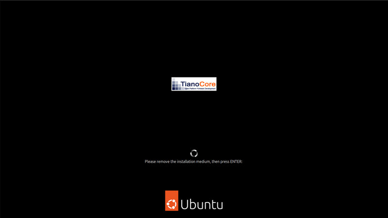

# Esercitazione 1 - Istallazione del'Ambiente Sviluppo: Ubuntu e VSCode
Questa guida descrive il processo di istalazione di la distribuzione di `Ubuntu 24.04 LTS`, un sistema operativo basato su Linux, e di `Visual Studio Code`, un editor di codice ampiamente utilizzato nello sviluppo software.

L'obbietivo di questa istallazione è configurare un ambiente adatto allo sviluppo di codice in `ROS2`. `Ubuntu` è il sistema operativo raccomandato per `ROS2` grazie alla sua compatibilità e supporto ufficiale, mentre `VSCode` offre un ambiente di sviluppo flessibile e potente per la scrittura e il debbuging.  

In questa sezione verrà illustrato il processo passo a passo per:
1) Scaricare e istallare `Ubuntu` su un computer.
2) Configurare `Ubuntu` con le opzioni esenziali per lo sviluppo.
3) Istallare e preparare `VSCode` con estenzioni utili per lavorare con `ROS2` (Python, C++, CMake, etc.).

## Istalazione di Ubuntu 24.04 LTS
### 1)  Scaricare un'immagine di Ubuntu 
Scaricare l'ISO di Ubuntu corrispondente all'architettura del portatile o PC da [questo link](https://ubuntu.com/download/desktop).


### 2) Creare una chiavetta USB 
Per installare Ubuntu Desktop, bisogna scrivere l'ISO scaricato su una chiavetta USB per creare il supporto di installazione. 

Questo tutorial usa [balenaEtcher](https://etcher.balena.io/) perché funziona su Linux, Windows e macOS. Scegliere la versione che corrisponde al attuale sistema operativo, scaricare e installare lo strumento.


Selezionare l'ISO scaricato, scegliere l'unità flash USB, cliccare su **`Flash!`** per scrivere l'immagine.



### 3) Avvio da unità flash USB

Inserire l'unità flash USB nel laptop o nel PC e avviare o riavviare il dispositivo. Dovrebbe riconoscere automaticamente il supporto d'installazione. In caso contrario, provare a tenere premuto F12 durante l'avvio e a selezionare il dispositivo USB dal menu di avvio specifico del sistema.

> 
> [!NOTE]\
> `F12` è il tasto più comune per richiamare il menu di avvio del sistema, ma `Escape`, `F2` e `F10` sono alternative comuni. Se non sicuro, cercare un breve messaggio all'avvio del sistema: spesso informa su quale tasto premere per accedere al menu di avvio.

Una volta inizializzato il programma di installazione, verrà chiesto di scegliere la lingua.


E poi verrà presentata l'opzione di selezionare le impostazioni di accessibilità.



Il layout della tastiera.


E la connessione alla rete. Ciò consente a Ubuntu di scaricare aggiornamenti e driver di terze parti (come i driver grafici NVIDIA) durante l'installazione.


Dopo di che verrà presentata l'opzione di provare oppure istallare Ubuntu.


> [!NOTE]\
> Cliccando su **`Prova Ubuntu`**, sarà possibile visualizzare l'anteprima di Ubuntu senza apportare modifiche al PC. Si può tornare al menu di installazione in qualsiasi momento cliccando sul collegamento **`Installa Ubuntu`** sul desktop.

Per procedere, cliccare  **`Installa Ubuntu`**.

> [!WARNING]\
> Alcuni PC utilizzano `Intel RST (Rapid Storage Technology)`, che non è supportato da `Ubuntu`. Se questo è il caso, non si sarà in grado di procedere oltre questo punto senza disabilitare `RST` nel menu `BIOS` della macchina.

### 5) Configurazione di istallazione 
In questo punto verrà chiesto di scegliere tra `Installazione interattiva` e `Installazione automatica`. L'opzione `interattiva` è la via standard, ma gli utenti più avanzati possono usare l'opzione di `installazione automatica` per importare un file di configurazione da un server web per standardizzare installazioni multiple e aggiungere ulteriori personalizzazioni.


Poi verrà chiesto di scegliere tra le opzioni `Selezione predefinita` e `Selezione estesa`. L'installazione `predefinita` include gli elementi essenziali di base per iniziare. La `selezione estesa` contiene strumenti e utilità per ufficio aggiuntivi, utili per le situazioni offline.


Nella schermata successiva verrà chiesto di installare software di terze parti che potrebbero migliorare il supporto e le prestazioni del dispositivo (ad esempio, driver grafici Nvidia) e il supporto per formati multimediali aggiuntivi. Si consiglia di selezionare entrambe queste caselle.


### 6) Tipo di istallazione

Questa schermata consente di configurare il tipo di installazione. Se si desidera che Ubuntu sia l'unico sistema operativo nel disco rigido, selezionare **`Cancella disco e installa Ubuntu`**.

Se il dispositivo ha attualmente un altro sistema operativo installato (ad es. Windows), si riceveranno opzioni aggiuntive per installare Ubuntu insieme a quel sistema operativo anziché sostituirlo. 


#### 6a) Installare Ubuntu insieme a un altro sistema operativo

Se questa opzione viene selezionata verrà fornita un'interfaccia semplice che consente di selezionare l'unità su cui si vuole installare Ubuntu e un cursore per determinare la quantità di spazio su disco per l'utilizzo. Lo spazio disponibile è limitato dal contenuto esistente del disco ed è progettato per evitare di sovrascrivere i file esistenti.


Questa vista seleziona automaticamente la partizione più grande sull'unità. Per un controllo più dettagliato è possibile passare all'opzione di partizionamento manuale che è descritta in dettaglio più avanti.

#### 6b) Cancellare disco e istallare Ubuntu
Con questa opzione si cancella tutto lo spazio del disco nella unità selezionata.


#### 6c) Partizionamento manuale

Il partizionamento manuale è stato pensato per gli utenti avanzati che desiderano creare delle configurazioni specifiche per i loro casi d'uso. Qui gli utenti possono vedere tutte le unità e le partizioni e creare nuove tabelle di partizioni e configurazioni.


### 7) Creazione dei dati di login

In questa schermata saranno richiesti il nome utente, il nome del computer (anche noto come `nome host`) e la password. 


### 8) Pronto per l'istallazione

Cliccando su **`Avanti`** verrà indirizzato a un riepilogo della configurazione dell'istalazione che darà la possibilità di controllare le opzioni scelte prima di fare click su **`Istalla`**.


Una volta proceduto, Ubuntu avvierà il processo di installazione.


### 9) Completare l'istallazione

Una volta finalizzato il processo d'istallazione, verrà richiesto il riavvio del dispositivo. Cliccare su **`Riavviare adesso`**.


Mentre si riavvia il dispositivo, verrà richiesta remozione del USB dal PC, una volta fatto ciò, premere **`↵ ENTER`**.



Al riavvio, segliere la voce Ubuntu nel menu che dobrevve comparire per avviare il sistema operativo. Attraverso questo menu poi si potrà anche scegliere avviare il resto di sistemi operativi che sono istallati nel PC.


Segue la schermata di login, dove si potrà inserire il nome utente e la password creati previamente. 


Finalmente, il desktop di Ubuntu compare ed è pronto al utilizzo.


## Istalazione di Visual Studio Code
### 1) Scaricare il pacchetto .deb
Il modo più semplice per installare Visual Studio Code per le distribuzioni basate su Debian/Ubuntu è scaricare il pachetto .deb (64 bit), tramite il Centro Software grafico, se disponibile, oppure da [questo link](https://go.microsoft.com/fwlink/?LinkID=760868).


### 2) Istallare il pachetto dal terminale (se il Centro Software non è disponibile)
Per istallare il pachetto .deb dal terminale, basta scrivere:
```
sudo apt install ./<file>.deb
```
Quando si installa il pacchetto .deb, viene richiesto di installare il repository apt e la chiave di firma per abilitare l'aggiornamento automatico tramite il gestore pacchetti del sistema.

### 3) Istallazione di estensioni di base
VS Code ha un ricco ecosistema di estensioni che consentono di aggiungere linguaggi, debugger e strumenti alla installazione per supportare il flusso di lavoro di sviluppo specifico. Ci sono migliaia di estensioni disponibili nel Visual Studio Marketplace.

####  Installare un'estensione di linguaggio per aggiungere supporto per Python o qualsiasi altro linguaggio di programmazione d'interesse.
1) 


2)


