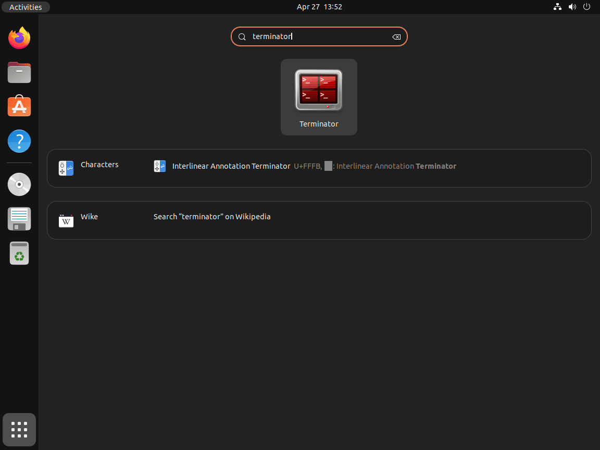

# Esercitazione 2 - Commandi Linux e Altri Tool

## Terminale

### Aprire il Terminale

#### 1) Tramite  una scorciatoia da tastiera
Il modo più semplice per aprire un terminale Linux è tramite una scorciatoia da tastiera. In Ubuntu e altre distribuzioni Linux, la maggior parte delle volte, la scorciatoia predefinita è `Ctrl+Alt+T` per aprire un terminale, come mostrato di seguito.


#### 2) Tramite il menu Attività
È il metodo generico per aprire il terminale dal menu di attività. Premendo il tasto `Windows` (o il tasto `Super` per Linux e il tasto di `Cmd` per macOS) per aprire il menu Attività e digitare "Terminale".
L'icona del terminale apparirà in alto. Cliccare su di esso per aprire il terminale Linux, come mostrato di seguito.


#### 3) Tramite il File Manager
Un altro modo per aprire direttamente il terminale in una posizione specifica sarebbe con l'aiuto del file manager `Nautilus` fornito con il gestore desktop `GNOME`.

Aprire il `file manager` e andare al percorso specifico in cui si vuole aprire il `terminale`, premendo il tasto destro su un'area vuota aprirà il `menu contestuale`. Cliccando sull'ultima opzione, `Apri in Terminale`, come mostrato di seguito.


### Scorciatoie principali

|Azione|Combinazione|
|:--:|:--:|
|Completamento automatico| `↹Tab`|
|Navigazione|`⇦` `⇨` `⇧` `⇩`|
|Cercare nella history| `Ctrl + R`|
|Cancellare a sisnistra| `Ctrl + H`|
|Cancellare ultima parola inserita| `Ctrl + W`|
|Cancellare intera riga| `Ctrl + U`|
|Pulire lo schermo|`Ctrl + L`|

## APT

### Aggiornare la lista dei pacchetti:

Per aggiornare la lista dei pacchetti nei `repository` Ubuntu, scrivere nel `Terminale`:
```
sudo apt update
```

### Aggiornare i pacchetti:

Per l'aggiornamento dei pacchetti basta scrivere:
```
sudo apt upgrade
```
### Istallazione pacchetti:

La istallazione si esegue con il seguente commando:
```
sudo apt install <nome del pacchetto>
```

### Rimozione dei pacchetti:
Per rimuovere un pacchetto scrivere nel terminale:
```
sudo apt remove <nome del pacchetto>
```
> ![TIP]\
> Con la flag `--purge` dopo il comando `remove` vengono eliminati anche i file di configurazione del pacchetto.

## Gedit

### Istallazione

1) Aprire il `Terminale` 


2) Aggiornare la lista dei pacchetti con:
```
sudo apt update
```

3) Istallare con:
```
sudo apt install gedit
```
4) Verificare l'istallazione:
```
gedit --version
```

### Lanciare
`Gedit` si può lanciare in vari modi:
1) Dal `Terminale`:
 
 Scrivendo 
 ```
 gedit
 ```

2) Dal menu Attività:


### Creazione dei file

Per creare un file nuovo:

1) Lanciare `gedit`
2) Fare clic sull'icona del menu hamburger accanto al pulsante `Salva` oppure utilizzare la scorciatoia `Ctrl + N`.

### Aprire un file esistente:

Cliccare `Open` oppure usare la scorciatoia `Ctrl + O`. Navigare alla posizione del file e selezionarlo.


### Salvare i file

Per salvare il lavoro, cliccare sul pulsante `Save`. Se si tratta di un file nuovo, si dovrà scegliere un nome e una posizione di salvataggio.

### Utilizzo dell'evidenziazione della sintassi

`Gedit` supporta l'evidenziazione della sintassi per vari linguaggi di programmazione. Ecco come abilitarla:

1) Aprire il file da modificare.
2) Fare clic su `Visualizza > Modalità evidenziazione`.
3) Sceglire il linguaggio dall'elenco (ad esempio, `Python`, `HTML`, ecc.).


## Terminator

Terminator è un robusto emulatore di terminale che offre funzionalità avanzate e opzioni di personalizzazione per gli utenti che hanno bisogno di più di ciò che i terminali tradizionali forniscono. Di seguito sono riportate alcune delle funzionalità principali di Terminator:

* **Finestre di terminale multiple**: con Terminator, gli utenti possono gestire e visualizzare in modo efficiente più terminali in una finestra, grazie alla sua capacità di dividere gli schermi verticalmente e orizzontalmente.
* **Interfaccia personalizzabile**: gli utenti possono personalizzare l'aspetto e il comportamento del loro terminale, regolando le dimensioni del carattere, i colori e i bordi delle finestre per creare uno spazio di lavoro comodo ed efficiente.
* **Scelte rapide da tastiera**: varie scorciatoie da tastiera facilitano la navigazione, il ridimensionamento rapido e l'accesso immediato ai comandi, migliorando la velocità e la produttività dell'utente.
Supporto Tab: il supporto Tab consente agli utenti di gestire più sessioni di terminale senza sforzo, promuovendo uno spazio di lavoro organizzato e ordinato.
* **Profili e layout**: Terminator consente agli utenti di salvare e applicare profili e layout personalizzati per creare un ambiente di lavoro coerente e specifico per l'utente.
* **Supporto Plugin**: gli utenti possono estendere ulteriormente le funzionalità di Terminator integrando vari plugin ed estensioni, aggiungendo preziosi strumenti e funzionalità al terminale.

### Installazione

Prima di installare Terminator, è necessario aggiornare il sistema Ubuntu per assicurarsi di avere gli ultimi pacchetti disponibili. Aprire il terminale ed eseguire il seguente comando:

```
sudo apt update
```

Questo comando recupera le informazioni del pacchetto da tutti i sorgenti configurati, il che aiuta a installare la versione più recente di Terminator nel repository Ubuntu.

Una volta che il sistema Ubuntu è aggiornato, procedere con l'installazione di Terminator utilizzando il seguente comando:
```
sudo apt install terminator
```

Questo comando cerca il pacchetto Terminator all'interno del repository Ubuntu e lo installa con le dipendenze richieste.

### Lanciare Terminator

#### 1) Dal terminale predefinito
Per avviare Terminator utilizzando l'interfaccia della riga di comando (CLI), aprire l'emulatore di terminale predefinito e digitare il comando seguente:
```
terminator
```
#### 2) Dalla interfaccia grafica
Se si preferisce avviare Terminator utilizzando l'interfaccia utente grafica (GUI), seguire questi passaggi:

1) Fare clic sul menu Attività o sull'icona Mostra applicazioni nell'angolo in basso a sinistra del desktop Ubuntu.
Nella barra di ricerca, digitare Terminator. I risultati della ricerca verranno filtrati durante il digitazione e l'icona Terminator dovrebbe apparire.

2) Fare clic sull'icona Terminator per avviare l'applicazione.




### Panoramica delle scorciatoie di Terminator

> ![NOTE]\
> Le scorciatoie base del terminale di Linux funzionano anche in Terminator.

|Azione|Combinazione|
|:--:|:--:|
|Spaccare in verticale|	`Ctrl+Shift+O`|
|Spaccare in orizzontale|	`Ctrl+Shift+E`|
|Cambiare al terminale successivo|	`Ctrl+Shift+N`|
|Cambiare al terminale precedente|	`Ctrl+Shift+P`|
|Nuova scheda|	`Ctrl + Shift + T`|
|Scheda successiva|	`Ctrl + Tab`|
|Scheda precedente|	`Ctrl + Shift + Tab`|
|Copia|	`Ctrl + Shift + C`|
|Incolla|	`Ctrl + Shift + V`|
|In chiaro|	`Ctrl + +`|
|Zoom fuori|	`Ctrl + -`|
|Reset Zoom di nuovo|	`Ctrl + 0`|
|Modalità a schermo intero|	`F11`|
|Chiudere il terminale|	`Ctrl + Shift + W`|

## SSH
Secure Shell (`SSH`) è un protocollo essenziale per accedere in modo sicuro alle macchine in rete da remoto. `SSH` offre un canale sicuro su una rete on protetta, fornendo un'autenticazione forte e comunicazioni di dati crittografate tra due computer che si connettono su una rete aperta come Internet. Ubuntu 24.04, come i suoi predecessori, supporta SSH per l'amministrazione remota, il trasferimento di file e altro ancora.

### Installazione

### 1) Prima dell'installazione
Asicurarsi che il sistema sia aggiornato con i comandi `apt update` e `apt upgrade`.

### 2) Installare OpenSSH Server:
Con il sistema aggiornato, il passo successivo è quello d'istallare il pacchetto OpenSSH server, il che contiene il software necessario per eseguire un server SSH:
```
sudo apt install ssh
```
Una volta installato, il servizio SSH dobrebbe partire automaticamente. Tuttavia, è sempre consigliato verificare che il servizio sia eseguito in maniera corretta.

#### Abilitazione del servizio SSH all'avvio
Per asicurarsi che `SSH` parte automaticamente dopo il riavvio bisogna abilitarlo tramite `systemctl`:
```
sudo systemctl enable ssh
```

> ![TIP]\
> Per comprobare lo stato di un servizio usare:
> ```
> systemctl status <nome_del_servizio.service>
> ```
> oppure usare il servizio di loggin del kernel `journal` con: 
> ```
> journactl -u <nome_del_servizio.service>
>```

Se il servizio non è ancora iniziato, farlo partire con il commando:
```
sudo systemctl start ssh
```

### Conessione tramite SSH
Con `SSH` abilitato sarà possibile la conessione con e da un altro PC usando la sintassi:
```
ssh nome_utente@nome_host_o_IP
``` 
> ![TIP]\
> Agguingendo il flag `-X` permette esguire applicazione grafiche in remoto.


## Git e GitHub

### Git

Git è un sistema di controllo delle versioni distribuito progettato per tracciare le modifiche nel codice sorgente durante lo sviluppo del software. Consente a più sviluppatori di collaborare a un progetto, garantendo un processo di sviluppo strutturato e organizzato.

#### Concetti chiave:

* **Repository (Repo)**: un repository è uno spazio di archiviazione per i file di progetto e l'intera cronologia delle modifiche.
* **Commit**: un commit è un'istantanea del progetto in un momento specifico, che conserva le modifiche e consente di ripristinarle se necessario.
* **Branch**: i branch consentono di lavorare su diverse funzionalità o correzioni di bug in modo indipendente, prevenendo conflitti nella base di codice principale.

* **Merge**: l'unione combina le modifiche da diversi branch in un singolo branch, garantendo una base di codice coesa.

#### Installazione

Per difetto `git` viene pre-installato in Ubuntu e la maggior parte di distro, per verificare questo, scrivere nel terminale:
```
git --version
```

Un output del tipo:
 ```
 git version 2.45.2
 ``` 
 nel terminale vuol dire che efftivamente git è installato .

 Nel caso in cui questo non viene verificato si procede a la installazione con `apt`:
 ```
 sudo apt install git
 ```

 > ![TIP]\
 > Ricordare sempre di aggiornare il sistema prima d'installare i pacchetti.

 #### Configurare git
 Per poter usare git, si consiglia configurare l'identità. Sostituire `nome` e `e-mail` nel commando in seguito d'accordo alla configurazione che si ha:
 ```
 git config --global user.name "nome"
 git config --global user.email "nome@email.com"
 ```

 > ![NOTE]\
 > Il flag `--global` influisce su tutti i repository con cui si lavora nel sistema.

 ### GitHub 

GitHub è una piattaforma basata su cloud per archiviare, condividere e lavorare insieme ad altri per scrivere codice e non solo.

Archiviare il codice in un "repository" su GitHub ti consente di:

* Mostrare o condividere il tuo lavoro.
* Monitorare e gestire le modifiche al tuo codice nel tempo.
* Lasciare che altri rivedano il codice e forniscano suggerimenti per migliorarlo.
* Collaborare a un progetto condiviso, senza preoccupazione che le modifiche influiscano sul lavoro degli altri collaboratori prima che esso sia pronto a integrare.

Il lavoro collaborativo, una delle funzionalità fondamentali di GitHub, è reso possibile dal software open source, Git, su cui è basato GitHub.

#### Creare un repositorio in GitHub

> ![NOTE]\
> Si deve avere un'account GitHub. Per maggiori informazioni, consultare  questo [link](https://docs.github.com/en/get-started/start-your-journey/creating-an-account-on-github).

1) Nell'angolo in alto a destra di qualsiasi pagina, selezionare `+` , quindi fare clic su `Nuovo repository`.


2) Nella casella "Nome repository", digitare il `nome del repositorio`.

3) Nella casella `Descrizione`, digitare una breve descrizione. Ad esempio, digitare `"Questo repository è un esempio"`.

4) Selezionare se il repository sarà pubblico o privato.

5) Selezionare `Aggiungere un file README`.

6) Fare clic su `Crea repository`.

#### Creare una branch

1) Fare clic sulla scheda Codice del repository.

2) Sopra l'elenco dei file, fai clic sul menu che dice `main`.


3) Digitare un nome di branch, (ad es. `altra-branch`), nella casella di testo.

4) Fare clic su `Creare branch`: `altra-branch` da main.


  
## Controllo di versione di Git con VSCode

Visual Studio Code ha integrato la gestione del controllo del sorgente (SCM) e include il supporto Git out-of-the-box. Molti altri fornitori di controllo delle fonti sono disponibili attraverso le estensioni sul Visual Studio Marketplace.

### Inizializzare un repositorio

Se lo spazio di lavoro è locale, è possibile abilitare il controllo della sorgente Git creando un repository Git con il comando `Initialize Repository`. Quando VS Code non rileva un repository Git esistente, la visualizzazione Controllo sorgente fornirà le opzioni per inizializzare il repository o la pubblicazione su GitHub.


È inoltre possibile eseguire i comandi Git: Initialize Repository e Pubblicare su GitHub dalla tavolozza dei comandi `Ctrl + Shift + P`.

* **Inizializzare Repositorio**: crea i file di metadati del repository Git necessario e mostra i file dello spazio di lavoro come modifiche non tracciate.
* **Pubblica su GitHub**: pubblica direttamente la cartella dell'area di lavoro in un repository GitHub, consentendo di scegliere tra repository privati e pubblici. 

### Clonare un repositorio

Se non si è ancora aperto una cartella, la vista Controllo codice sorgente offrirà le opzioni `Aprire cartella` dal computer locale o `Clona repository`.


Se si seleziona Clone Repository, verrà chiesto l'URL del repository remoto (ad esempio su GitHub) e la directory padre in cui mettere il repository locale.

Per un repository GitHub, l'URL si trova nella finestra di dialogo GitHub `Code`.


Quindi incollare quell'URL nel prompt `Git: Clone`.


Esiste anche l'opzione Clone from GitHub. Una volta che si è autenticato con il account GitHub in VS Code, si sarà in grado di cercare nei repository per nome e selezionare qualsiasi repository per clonarlo. Si può anche avviare il flusso per clonare un repository Git con il comando `Git: Clone` nella `Command Palette`.

### I commit
Ogni file nella directory di lavoro può essere in uno dei due stati: `tracciato` o `non tracciato`. I file tracciati sono file che erano nell'ultimo snapshot, così come tutti i file appena messi in staging; possono essere `non modificati`, `modificati` o `messi in staging`. In breve, i file tracciati sono file che Git conosce.

I file non tracciati sono tutto il resto, tutti i file nella directory di lavoro che non erano nell'ultimo snapshot e non sono nell'area di staging. Quando si clona per la prima volta un repository, tutti i file saranno tracciati e non modificati perché Git li ha appena estratti e non sono modificato.

Mentre si modificha i file, Git li vede come `modificati`, perché sono stati cambiati dall'ultimo commit. Mentre si lavora, si mettono selettivamente in `staging` questi file modificati per poi eseguire il commit di tutte quelle modifiche messe in staging, e il ciclo si ripete.


Lo staging e l'unstaging possono essere eseguiti tramite azioni contestuali nei file o tramite trascinamento. Si può srivere un messaggio sopra le modifche e con `Ctrl + Enter` fare il commit. 


Quando viene configurato un repository remoto, si può vedere quanti commit si è avanti o indietro rispetto al remoto. La sezione` Source Control Graph` della vista `Source Control` mostra una rappresentazione grafica dei commit in entrata e in uscita.

Il grafico contiene il ramo corrente, il ramo upstream del ramo corrente e un ramo base facoltativo. La radice del grafico è l'antenato comune di questi rami.


