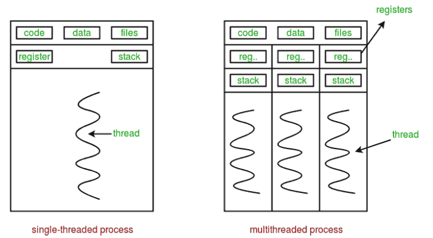
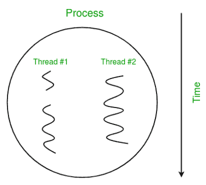
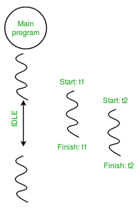

# Esercitazione 5 - Python3 Basico: Parte III

## Classi in Python

### Breve Introduzione alla Programmazione Orientata agli Oggetti 

La programmazione orientata agli oggetti è un paradigma che utilizza “oggetti” – combinazioni di dati e funzioni incapsulate – per progettare e realizzare applicazioni. Gli oggetti rappresentano entità del mondo reale dotate di proprietà (attributi) e comportamenti (metodi).

- **Vantaggi dell'OOP:**  
  - **Modularità:** Il codice è organizzato in unità logiche e autonome.  
  - **Riutilizzabilità:** Classi e oggetti possono essere riutilizzati in diversi progetti.  
  - **Manutenibilità:** Le modifiche risultano più semplici grazie all'incapsulamento.

 
> [!TIP]    
> Immaginate il progetto di una macchina. Il progetto definisce cosa sia una macchina, mentre ogni macchina reale può differire per colore o accessori. Nel codice, il progetto è rappresentato da una classe, e le macchine sono le istanze (oggetti).

### Definire Classi e Creare Oggetti

#### Definizione di una Classe:
Rispetto ad altri linguaggi di programmazione, il meccanismo delle classi di Python gli aggiunge con un minimo di nuova sintassi e semantica. La forma più semplice di definizione di classe appare così:

  ```python
  class ClassName:
      def __init__(self, parameter):
          self.attribute = parameter

      def method(self, argument):
        return 
  ```

Il metodo `__init__` è il "costruttore" che inizzializa un nuovo oggetto.

> [!NOTE]   
> Nella realtà il metodo `__init__` non equivale ai costruttori presenti negli altri linguaggi, poiché non crea l’istanza, ma la inizializza solamente. Dietro le quinte viene invocato dapprima il metodo `__new__` che crea un'istanza della classe.

Tutti i metodi di una classe devono definire un parametro aggiuntivo chiamato `self` che rappresenta l'istanza dell'oggetto che invoca il metodo. Quando si invoca il metodo, il parametro `self` non deve essere passato esplicitamente, ma è automaticamente sostituito dall'istanza su cui è stato invocato il metodo secondo la notazione
`instance.method()`.

Ogni istanza potrà avere dunque un valore diverso associato ai propri attributi, i quali sono definiti all'interno del metodo `__init__` e prendono il nome di **attributi d'istanza**. Qualora invece ci debbano essere dei parametri condivisi tra tutte le istanze di una stessa classe, si definiscono delle variabili appena dentro la classe e vengono identificate come **attributi di classe**.

> [!NOTE]   
> Un classico esempio per entrare in confidenza con classi, istanze e metodi è fornito dalla seguente classe `Car`:
> 
> ```python
> class Car:
>    # Attributo di classe: condiviso da tutti gli oggetti Car
>    wheels = 4
>
>    def __init__(self, make, model, color):
>        # Attributi di istanza: unici per ogni oggetto
>        self.make = make
>        self.model = model
>        self.color = color
>
>    def start(self):
>        print(f"{self.make} {self.model} si sta avviando.")
>
>    def stop(self):
>        print(f"{self.make} {self.model} si sta fermando.")
> 
> # Creazione di un oggetto
> my_car = Car("Toyota", "Corolla", "blu")
> my_car.start()
> print(f"Questa macchina ha {Car.wheels} ruote.")
> ```

### Metodi Speciali e Overloading delgi Operatori

Le classi supportano anche diversi **metodi speciali** che sono identificati dalla presenza di due underscore (`__`) prima e dopo il nome. Questi metodi, in genere, non vengono chiamati direttamente con la sintassi `instance.__method__`, ma vengono invocati implicitamente e automaticamente in situazioni particolari; un esempio, già incontrato, è dato dal metodo `__init__` che viene invocato automaticamente quando si fa ricorso alla sintassi `ClassName(param)` per creare un nuovo oggetto di quel tipo.  
* `__str__`:  Fornisce una rappresentazione in stringa dell'oggetto.
* `__len__`:  Ritorna la lunghezza dell'oggetto, un `int`>=0.
* `__hash__`: Ritorna un'intero che reappresenta il [hash](https://it.wikipedia.org/wiki/Funzione_di_hash) del'oggetto.

Altri metodi speciali sono quelli che vengono invocati quando si utilizzano gli operatori relazionali, aritmetici, ecc., fra oggetti di una stessa classe, come:
|Operatore|Metodo|Descrizione|
|:--:|:--:|:--:|
| `==`      | `__eq__` | Definisce il criterio di uguaglianza fra oggetti diverso da quello standard basato sugli indirizzi di memoria.|
| `>` `>=`  | `__gt__` `__ge__`| Definisce il criterio di maggioranza tra oggetti. |
| `<` `<=`  | `__lt__` `__le__` | Definisce il criterio di minoranza tra oggetti. |
| `+` | `__add__` `__radd__` `__iadd__`| Definisce l'operazione di somma tra oggetti. |
| `-` | `__sub__` `__rsub__` `__isub__`| Definisce l'operazione di sottrazione tra oggetti. |
| `*` | `__mul__` `__rmul__` `__imul__`| Definisce l'operazione di prodotto tra oggetti. |
| `/` | `__truediv__` `__rtruediv__` `__itruediv__`| Definisce l'operazione di divisione tra oggetti. |   

> [!NOTE]
> Considerare che si hannoo due oggetti che sono una rappresentazione fisica di una classe (tipo di dati definito dall'utente) e dobbiamo aggiungere due oggetti con l'operatore binario '+', che genera un errore, perché il compilatore non sa come aggiungere due oggetti. Quindi definiamo un metodo per un operatore e quel processo è chiamato **overloading dell'operatore**. Possiamo sovraccaricare tutti gli operatori esistenti ma non possiamo creare un nuovo operatore.

> [!NOTE]   
> In questo esempio si riassume tutto quanto detto sopra:   
> ```python
> class Point:
>     def __init__(self, x, y):
>         self.x = x
>         self.y = y
> 
>     def __str__(self):
>         return f"Point({self.x}, {self.y})"
> 
>     def __add__(self, other):
>         return Point(self.x + other.x, self.y + other.y)
> 
> p1 = Point(1, 2)
> p2 = Point(3, 4)
> print(p1)           # Invoca __str__
> print("Somma:", p1 + p2)  # Usa __add__
> ```

### Ereditarietà

Python supporta il meccanismo dell'ereditarietà che permettere di estendere (extends) una classe già esistene - più generale - con una classe - più specializzata - che ne eredita tutti gli attributi e i metodi, e ne esporta di nuovi più specifici. La creazione di una classe erede prevede di specificare in fase di dichiarazione la classe padre che vuole estendere.
```python
class DerivedClassName(BaseClassName):
  .
  .
  .
```
È anche possibile, nella sottoclasse, sovrascrivere (_override_) e quindi ridefinire metodi definiti dalla superclasse. All'interno della sottoclasse, se si vuole far riferimento ad un metodo della superclasse è possibile usare la funzione built-in `super` (la quale restituisce un riferimento alla classe base) per accedere al metodo corrispondente definito nella classe base.
```python
class DerivedClassName(BaseClassName):
  def __init__(self):
    super().__init_()
```
Python supporta anche il meccanismo più complesso dell'**ereditarietà multipla**, consentendo di specificare tutte le `super class` da cui eredità, separate da virgole. 
```python
class DerivedClassName(BaseClass1Name, BaseClass2Name, BaseClass3Name):
  .
  .
  .
```

> [!NOTE]   
> Si suppone di avvere una classe base (super class) `Person`:
> ```python
> class Person:
>     planet = 'Earth'
>     def __init__(self, name, dd, mm, yy):
>         self.name = name
>         self.date = (dd,mm,yy)
>   
>     def get_age(self, curr_year):
>         age = curr_year-self.date[-1]
>         if age < 0:
>             print('Year must be bigger then '+str(self.date[-1]))
>             return 0
>         return age
>     
>     # used when call '>'
>     def __gt__(self, p):
>         if self.date[2] < p.date[2]:
>             return True
>         elif self.date[2] > p.date[2]:
>             return False
>     
>      # used when call '<'
>     def __lt__(self, p):
>         return self.date[2] > p.date[2]
> ```
> Una classe erede specializza una classe precedentemente creata, rappresentando una entità più specifica della precedente. Per ereditare da una classe definita in un altro file (ad es. `person.py`) è necessario ricorrere all'operazione di `import`. 
> ```python
> from person import Person
> class Student(Person):
>     def __init__(self, name, dd, mm, yy, id_num):
>         super().__init__(name,dd,mm,yy) # call super class constructor
>         self.id_num = id_num
>   	
>     # Override methods
>     # used when call '>'
>     def __gt__(self, p):
>         return self.id_num < p.id_num
>       
>     # Override methods
>     # used when call '<'
>     def __lt__(self, p):
>         return self.id_num > p.id_num
> ```

> [!NOTE]   
> Nell'esempio la classe `Student` eredita dalla classe `Person`, in quanto uno studente è sì una persona generica, ma con degli attributi in più come un numero di matricola. In questo caso è probabilmente più interessante sapere quale studente si sia immatricolato prima di un altro per avere un criterio di ordinamento, anziché basarsi sull'età anagrafica. È da notare che uno studente è una persona, ma una persona non necesariamente deve essere uno studente: **l'ereditarietà è una relazione unidirezionale**.

> [!NOTE]    
> #### Controllori PID
> Nella pratica industriale e generalmente del controllo automatico, si utilizzano molto spesso dei regolatori `standard`, grazie ai quali è possibile ottenere le prestazioni desiderate tramite la taratura (*tuning*) di pochi parametri. I controllori `PID` rientrano in questa famiglia, e possono essere implementati in forma digitale in diversi modi. Di seguito si farà uso del paradigma ad oggetti per creare delle entità del tutto generiche che potranno essere inizializzate caso per caso, in funzione del problema di controllo che si deve risolvere.   
> Un `PID` è un controllore dinamico il che forsnice un'azione di contorllo proporzionale (da cui il nome) all'errore `e(t)`, al suo integrale e alla sua derivata. Matematicamente si può definire attraverso la seguente equazione:
> <center> <a href="https://www.codecogs.com/eqnedit.php?latex=u(t)&space;=&space;K_p&space;e(t)&space;&plus;&space;K_i&space;\int_0^t&space;e(\tau)d\tau&space;&plus;&space;K_d&space;\frac{d}{dt}e(t)" target="_blank"></a> </center> 
>  
> Affinché sia possibile implementarne una versione digitale è necessario trasformare l'equazione precedente nella sua forma `discretizzata`:  
> <center> <a href="https://www.codecogs.com/eqnedit.php?latex=u_k&space;=&space;K_p&space;e_k&space;&plus;&space;K_i&space;\sum_{i=0}^k&space;e_i&space;&plus;&space;K_d&space;\frac{e_k-e_{k-1}}{T_c}" target="_blank"></a> </center>
> 
> Sebbene l'implementazione di questa formula sia possibile senza troppo dispendio di energie dal punto di vista della programmazione, dal punto di vista computazionale risulta poco performante in quanto il calcolo dell'integrale mediante sommatoria richiederebbe la memorizzazione di tutti i campioni passati e, ad ogni istante, un ciclo di somme il cui numero di addendi cresce di continuo. Una formulazione ricorsiva più efficiente è la seguente:
> <center> <a href="https://www.codecogs.com/eqnedit.php?latex=u_k&space;=&space;K_p&space;e_k&space;&plus;&space;K_i&space;\underbrace{(S_{k-1}&space;&plus;&space;T_c&space;e_k)}_{S_k}&space;&plus;&space;K_d&space;\frac{e_k-e_{k-1}}{T_c}" target="_blank"></a> </center>
> 
> Dove il termine `Sk` rappresenta un accumulatore dell'errore passo dopo passo e sostituisce la sommatoria.
> > [!NOTE]    
> > I controllisti già sanno che la derivazione della formula discreta del PID dipende dal tipo di approssimazione utilizzata (_differenze in avanti_, _differenze all'indietro_, _metodo di Tustin_), come anche conoscono l'esistenza della formulazione del PID con l'annesso filtro passa-basso o, ancora, l'esistenza di criteri di taraura dei parametri (la taratura "per tentativi" è un'invenzione degli ultimi tempi, da non considerarsi autorevole, un ingegnere del controllo dovrebbe dunque ricorrere a tecniche più scientifiche. Attenzione che le tecniche _empiriche_ non sono equivalenti alla scelta aleatoria dei parametri).  
>
> L'entità PID può essere modellata attraverso una classe. Dalla precedente formula ricorsiva è possibile inferire sia l'algoritmo di controllo da implementare nell'apposito metodo, sia gli attributi (parametri e variabili) di cui ogni oggetto PID deve disporre.
> ```python
> class PID:
>     def __init__(self, Kp, Ki=0, Kd=0, Tc=0.1):
>         self.Kp = Kp
>         self.Ki = Ki
>         self.Kd = Kd
>         self.Tc = Tc
>         self.Sk = 0
>         self.ek_1 = 0
>         
>     def calculate(self, yk, r):
>         ek = r-yk
>         self.Sk += ek*self.Tc
>         uk = self.Kp*ek + self.Ki*self.Sk + self.Kd*(ek - self.ek_1)/self.Tc
>         self.ek_1 = ek
>         return uk
>       
>     def reset(self):
>         self.Sk = 0
>         self.ek_1 = 0
> ```
> Quando si lavora con attuatori reali, questi presentano dei limiti fisici di funzionamento in termini del segnale di controllo (forza, coppia, tenisione) che riescono a generare. Tali valori rappresentano il limite di **saturazione** dell'attuatore, ed è dunque opportuno fare in modo che l'algoritmo di controllo non generi azioni di controllo superiori a questi valori: sia perché irrealizzabili, sia perchè lavorare ai limiti fisici porta a una maggiore usura degli attuatori. In caso di saturazione, è consigliato inoltre gestire opportunamente l'effetto integrale, il quale, altrimenti, potrebbe generare fenomeni di _windup_. Gli algoritmi di **anti-windup** prevedono di bloccare o decrementare l'accumulo dell'integrale qualora il sistema vada in saturazione, per evitare un rallentamento della reattività del controllo. È possibile definire una nuova classe che aggiunga tali funzionalità alla classe PID precedente, in accordo con il meccanismo dell'ereditarietà. 
> ```python
> class PID_Saturation(PID):
>     def __init__(self, Kp, Ki=0, Kd=0, Tc=0.1 u_max=1):
>         super().__init__(Kp,Ki,Kd,Tc) # call super class constructor
>         self.u_max = abs(u_max)
>         
>     # Override methods
>     def calculate(self, yk, r):
>         uk = super().calculate(yk,r)
>         if not(-self.u_max <= uk <= self.u_max):
>             self.Sk -= (r-yk)*self.Tc # anti-windup
>             return (uk/abs(uk))*self.u_max
>         return uk
> ```

## Multithreading in Python

Prima di approfondire le complessità del multithreading in Python, è fondamentale comprendere il concetto di processo in informatica. Un processo rappresenta un'istanza di un programma in esecuzione e costituisce la base su cui si fonda il multithreading. Ogni processo si compone di tre elementi fondamentali:

* Un Programma Eseguibile: Il codice che il processore esegue.
* Dati Associati: Le variabili, l'area di lavoro, i buffer e gli altri dati necessari al funzionamento del programma.
* Contesto di Esecuzione: Lo stato del processo, che include il valore dei registri e il contatore del programma.

### Thread

Un `thread` è un'entità all'interno di un processo che può essere pianificata per l'esecuzione. Inoltre, è la più piccola unità di elaborazione che può essere eseguita in un SO (sistema operativo). In parole semplici, un thread è una sequenza di tali istruzioni all'interno di un programma che può essere eseguita indipendentemente da altro codice.

> [!TIP]    
> Per semplicità, si può supporre che un `thread` sia semplicemente un sottoinsieme di un processo!

Possono esistere più thread all'interno di un processo in cui:
* Ogni thread contiene il proprio set di registri e variabili locali (memorizzate nello stack).
* Tutti i thread di un processo condividono variabili globali (memorizzate nell'heap) e il codice del programma.

> [!NOTE]   
> Considerare il diagramma seguente per comprendere come esistano più thread nella memoria:   
> 

### Multi-Threading

Il `multithreading` è definito come la capacità di un processore di eseguire più thread contemporaneamente. In una semplice CPU single-core, si ottiene utilizzando frequenti passaggi tra thread. Questo è definito **context switching**. Nel context switching, lo stato di un thread viene salvato e lo stato di un altro thread viene caricato ogni volta che si verifica un'interruzione (dovuta a I/O o impostata manualmente). Il context switching avviene così frequentemente che tutti i thread sembrano essere in esecuzione parallelamente (questo è definito **multitasking**).

> [!NOTE]   
> L'esecuzione di più thread in maniera concorrente, spesso viene usata per migliorare le prestazioni in operazioni I/O-bound o ad alta latenza.



#### Concorrenza vs. Parallelismo:
La **concorrenza** implica che più compiti possano progredire simultaneamente, mentre il **parallelismo** significa che i compiti vengono eseguiti esattamente nello stesso istante (dipende dall'hardware e dall'implementazione dell'interprete).


### Fondamenti del Modulo `threading` di Python

In Python, il modulo `threading` fornisce un'API molto semplice e intuitiva per generare più thread in un programma.
```python
import threading
```
#### Creazione di Thread
Per creare un nuovo thread, basta creare un oggetto della classe `Thread`. Accetta `target` e `args` come parametri. Dove:
* `target`: è la funzione che deve essere eseguita dal thread.
* `args`: sono gli argomenti da passare alla funzione target.

```python
t1 = threading.Thread(target, args)
t2 = threading.Thread(target, args)
```
#### Avvio e Attesa dei Thread
Usando il metodo `start()`della classe `Thread` è possibile avviare il thread in background.
```python
t1.start()
t2.start()
```
Per evitare che il programma principale termini dopo aver lanciato i thread, ma prima che questi abbiano terminato, si utilizza il metodo `join` che attende che il thread su cui viene invocato termini le proprie operazioni.
```python
t1.join()
t2.join()
```
Di conseguenza, il programma corrente attenderà prima il completamento di `t1` e poi di `t2`. Una volta terminati, vengono eseguite le istruzioni rimanenti del programma corrente.

> [!NOTE]   
> #### Thread Basato su Funzioni:
> ```python
> import threading
>
> def print_cube(num):
>    print("Cube: {}" .format(num * num * num))
>
>
> def print_square(num):
>    print("Square: {}" .format(num * num))
>
>
> if __name__ =="__main__":
>    t1 = threading.Thread(target=print_square, args=(10,))
>    t2 = threading.Thread(target=print_cube, args=(10,))
>
>    t1.start()
>    t2.start()
>
>    t1.join()
>    t2.join()
>
>    print("Done!")
> ```

> [!NOTE]   
> Per comprendere meglio il funzionamento del programma sopra descritto, si consideri il diagramma seguente:    
> 

### Sincronizzazione dei Thread e Dati Condivisi

La gestione di risorse condivise (*variabili*) richiede l'utilizzo di opportuni strumenti di sincronizzazione onde evitare che si possano verificare problemi di inconsistenza dei dati dovuti all'accesso e alla modifica simultanea delle stesse (*race condition*). Il modulo `threading` mette a disposizione gli oggetti `Lock` (lucchetti), i quali sono degli oggetti la cui istanza è condivisa tipicamente dai diversi thread; un thread deve "entrare in possesso" del lucchetto prima di poter procedere all’esecuzione di una sezione protetta (*sezione critica*) di un programma, che accede alle variabili condivise con gli altri. \
Il lucchetto deve essere acquisito (metodo `acquire`) prima di entrare nella sezione critica e rilasciato (metordo `release`) non appena ne è uscito. Tale meccanismo permette di realizzare l'accesso in mutua esclusione alle sezioni critiche del codice, garantendo che un solo thread per volta possa accedere alle variabili condivise. 

> [!NOTE]   
> Un thread che trova il lucchetto chiuso - occupato - rimane in attesa che chi lo sta utilizzando lo rilasci prima di poter proseguire nell'esecuzione del suo codice.

> [!NOTE]   
> #### Utilizzo di un Lock:
> ```python
> import threading
> 
> # Risorsa condivisa: un contatore globale
> counter = 0
> counter_lock = threading.Lock()
> 
> def increment_counter():
>     global counter
>     for _ in range(100000):
>         with counter_lock:  # Garantisce che un solo thread modifichi il contatore alla volta
>             counter += 1
> 
> # Creazione di più thread per incrementare il contatore
> threads = [threading.Thread(target=increment_counter) for _ in range(5)]
> for t in threads:
>     t.start()
> for t in threads:
>     t.join()
> 
> print("Valore finale del contatore:", counter)
> ```

### Esempio Complessivo: Buffer Produttore-Consumatore

Un noto esempio di programmazione concorrente può essere ritrovato nel classico problema dei produttori e dei consumatori. Il problema mette di fronte alla seguente situazione: esistono uno o più produttori che inseriscono all'interno di un buffer, di dimensione limitata e nota, dei prodotti di qualsiasi tipo; dall'altra parte vi sono uno o più consumatori che al contempo prelevano i prodotti precedentemente inseriti secondo una politica FIFO. La problematica sorge nell'accesso contemporaneo al mezzo di più attori: nel caso di più produttori, ad esempio, potrebbe succedere che entrambi verifichino contestualmente la capienza residua del buffer e la confrontino con la quantità di elementi che ciascuno di essi vuole inserire. In caso di spazio sufficiente entrambi potrebbero provvedere ad inserire i propri prodotti all'interno del buffer, tuttavia, se la capienza registrata inizialmente dai singoli non è suffiiente ad ospitare la somma dei prodotti dei diversi produttori, si andrà incontro ad un overflow del buffer. Situazione analoga si potrebbe presentare nel caso di più consumatori che si accingono a prelevare degli elementi dal buffer: dopo aver valtato singolarmente che ci sono sufficienti elementi nel buffer, potrebbero andare a prelevare contemporaneamente i prodotti, ritrovandosi a voler prelevare da un buffer vuoto poiché qualcun altro è riuscito a prelevare prima del consumatore "sfortunato". Tali problematiche possono portare ora ad errori di accesso in memoria (IndexError) ora ad inconsistenza dei dati. Per tale motivo è necessario rendere atomiche le operazioni critiche di verifica, riempimento e prelievo dal buffer attraverso sistemi di mutua esclusione nell'accesso alla risorsa condivisa.
Il buffer condiviso può essere modellato come una classe che oltre a contenere il buffer stesso, mette a disposizione i metodi per la verifica dei posti disponibili e l'aggiunta o la rimozione di elementi da esso, oltre a dei metodi per l'accesso esclusivo all'insieme di elementi. Affinché sia in grado di fornire tali funzionalità, è necessario che in fase di inizializzazione provveda ad istansiare un oggetto di tipo Lock per garantire l'atomicità delle operazioni.
```python
class Buffer:
    def __init__(self, size):
        self.size = size
        self.buffer_queue = []
        self.mutex = Lock()
        
    def acquire_lock(self):
        self.mutex.acquire()

    def release_lock(self):
        self.mutex.release()

    def empty_pos(self):
        return self.size - len(self.buffer_queue)

    def full_pos(self):
        return len(self.buffer_queue)

    def add(self, product):
        self.buffer_queue.extend(product)
        print('BUFFER: '+str(self.buffer_queue))

    def get(self, n):
        for i in range(n):
            self.buffer_queue.pop(0)
        print('BUFFER: '+str(self.buffer_queue))
```

Le entità dei produttori e consumatori possono essere modellate mediante apposite classi eredi della classe Thread.
Un produttore può essere identificato da un nome proprio inoltre deve avere il riferimento ad un oggetto di tipo Buffer che sarà condiviso con gli altri produttori/consumatori. Il ciclo di vita di un produttore - implementato nell'override del metodo run - consiste nel voler caricare un certo numero di prodotti (casuale) nel buffer, a patto di non saturarlo. Il suo modus operandi prevede dunque di effettuare le seguenti operazioni in maniera atomica: prima verificare la disponibilità di posto nel buffer e, successivamente, caricare i gli elementi da esso prodotti nel buffer, nel limite della capienza. Dopo aver compiuto tali operazioni il thread può andare a dormire per un certo tempo fisso per ricominciare successivamente con tali attività. È possibile dotare la classe di una variabile d'istanza booleana che permetta al thread principale che lancia i thread figli di interrompere l'esecuzione dei vari produttori/consumatori istanziati.

```python
class Producer(Thread):
    def __init__(self, name, buffer):
        super().__init__()
        self.name = name
        self.buffer = buffer
        self.stop_flag = False

    def run(self):
        while not self.stop_flag:
            n = random.randint(1,5)
            product = []
            for i in range(n):
                product.append(random.randint(0,100))
            print(self.name+' wait lock')
            self.buffer.acquire_lock()
            print(self.name+' get lock')
            ##### Critical Section #####
            if self.buffer.empty_pos() < n:
                n = self.buffer.empty_pos()
            self.buffer.add(product[0:n])
            print('Producer '+self.name+' put '+str(n)+' elements')
            #############################
            print(self.name+' release lock')
            self.buffer.release_lock()
            time.sleep(3)
```
Analogamente, i consumatori sono caratterizzati da un nome e dal riferimento al buffer. Il loro ciclo di vita è speculare a quello del produttore: in maniera atomica verifica la presenza di prodotti nel buffer e provvede a prelevare un numero aleatorio di elementi da questo. In seguito a tali operazioni il thread si pone a riposo per un certo periodo dopodicché riprende nuovamente a consumare.

```python
class Consumer(Thread):
    def __init__(self, name, buffer):
        super().__init__()
        self.name = name
        self.buffer = buffer
        self.stop_flag = False

    def run(self):
        while not self.stop_flag:
            n = random.randint(1,2)
            print(self.name+' wait lock')
            self.buffer.acquire_lock()
            print(self.name+' get lock')
            ##### Critical Section #####
            if self.buffer.full_pos() < n:
                n = self.buffer.full_pos()
            self.buffer.get(n)
            print('Consumer '+self.name+' get '+str(n)+' elements')
            #############################
            print(self.name+' release lock')
            self.buffer.release_lock()
            time.sleep(2)
```

Le classi sopra presentate possono essere definite all'interno di un unico file o di file separati (nel qual caso sarà necessario importarle nel file principale che manda in esecuzione i diversi thread). Nel `__main__` è necesario dapprima istanziare un oggetto della classe buffer, successivamente creare diverse istanze di produttori e consumatori i quali saranno posti in run attraverso l'apposita chiamata al metodo `start` esportato da ciascuno di essi. La simulazione di attività può essere stoppata dopo un certo tempo prefisato settando a `True` tutte le `stop_flag` dei vari thread.

```python
if __name__ == '__main__':
    buffer = Buffer(10)
    p1 = Producer('P1',buffer)
    c1 = Consumer('C1',buffer)
    c2 = Consumer('C2',buffer)
    p1.start()
    c1.start()
    c2.start()
    time.sleep(10)
    p1.stop_flag = True
    c1.stop_flag = True
    c2.stop_flag = True
```
Di seguito è riportato uno scenario di simulazione in cui è possibile notare, analizzando le stampe a video, le fasi di contxt-switch che hanno alternato le operazioni dei vari thread (interleaving) senza però generare problemi di inconsistenza dati o errori grazie alla corretta gestione della risorsa condivisa. È possibile notare come i thread che trovano il lucchetto occupato rimangano in attesa che questo venga rilasciato pirma di proseguire con le proprie operazioni.

```bash
P1 wait lock
P1 get lock
BUFFER: [29, 28, 88]
C1 wait lock
Producer P1 put 3 elements
P1 release lock
C2 wait lock
C1 get lock
BUFFER: [28, 88]
Consumer C1 get 1 elements
C1 release lock
C2 get lock
BUFFER: [88]
Consumer C2 get 1 elements
C2 release lock
C1 wait lock
C2 wait lock
C1 get lock
BUFFER: []
Consumer C1 get 1 elements
C1 release lock
C2 get lock
BUFFER: []
Consumer C2 get 0 elements
C2 release lock
P1 wait lock
P1 get lock
... ...
```
---

### **Risorse Aggiuntive:**
- **Documentazione Ufficiale:**  
  - [Tutorial sulle Classi in Python](https://docs.python.org/3/tutorial/classes.html)  
  - [Libreria Threading in Python](https://docs.python.org/3/library/threading.html)
---